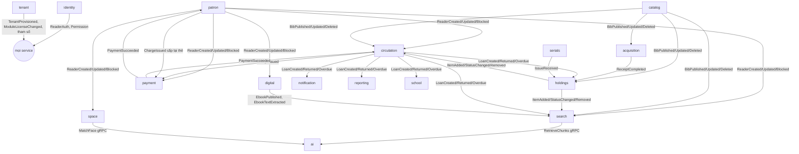

# 02 — Phân rã service

## 1. Nguyên tắc tách

1. **Mỗi bounded context là một service.** Mỗi service sở hữu duy nhất một database và là nguồn sự thật (source of truth) cho dữ liệu của mình. Service khác chỉ đọc qua API, event hoặc bản sao cục bộ.
2. **Ranh giới đi theo gói bán.** Không có service nào thuộc hai gói, để tắt một gói không làm hỏng gói khác.
3. **Dữ liệu cùng thay đổi trong một transaction thì ở cùng service.** Ví dụ: phiếu mượn, gia hạn và phiếu phạt cùng nằm trong `circulation`.
4. **Không tách quá mịn.** Các danh mục nhỏ (MARC, từ điển, trạng thái) đi theo service dùng chúng.
5. **Nhiều service có thể chạy chung pod ở profile nhỏ** ([06](06-nen-tang-k8s.md#2-profile-triển-khai)), nhưng **ranh giới DB không bao giờ gộp**.

## 2. Danh sách service

| Gói | Service | Trách nhiệm | Dữ liệu sở hữu (tiêu biểu) | Scale |
|---|---|---|---|---|
| **Nền tảng** (bắt buộc) | `identity` | Đăng nhập nhân viên/bạn đọc, OTP/captcha, phát token, vai trò, quyền, module, xác thực bạn đọc qua LDAP/API ngoài | Users, Roles, Permissions, Modules, GroupUsers | Thấp–vừa |
| | `tenant` | Đơn vị, tổ chức, tham số hệ thống, **license module**, khởi tạo đơn vị mới, danh mục tham chiếu chung | Tenants, Orgs, SystemParameters, Nations, Degrees… | Thấp |
| | `patron` | Hồ sơ bạn đọc, loại bạn đọc, nhóm, lớp/khoá, import, ảnh, thẻ, khoá thẻ | Readers, ReaderTypes, GroupReaders, Classes | Vừa |
| | `notification` | Gửi Email/SMS/Zalo ZNS theo template, nhật ký gửi, báo cáo định kỳ qua email | NotificationChannelConfigs, NotificationLogs, ScheduledReports | Theo hàng đợi |
| | `media` | Upload, presigned URL, ảnh bìa, xử lý ảnh, file server cũ | (metadata file) + MinIO | Vừa |
| | `audit` | Nhật ký thao tác, lịch sử thay đổi, log SIP2, giám sát tác vụ hàng loạt (AdminTask) | UserLogs, Sip2Logs, AdminTasks* | Theo hàng đợi |
| **Sách in** | `catalog` | Biên mục MARC21/AACR2/ISBD, worksheet, từ điển (tác giả, phân loại, từ khoá, NXB…), nhật ký biên mục | Bibs, BibXmls, Marc*, Dic*, Worksheet* | Vừa |
| | `holdings` | Bản sách (đăng ký cá biệt), kho, tủ/ngăn, giao nhận, chuyển kho, kiểm kê, thanh lý, mất sách, xuất kho | Barcodes, Stores, Inventories, Thanhlys, AbMoves | Vừa |
| | `circulation` | Mượn/trả/gia hạn, đặt mượn, chính sách lưu thông, điểm lưu thông, **tính phạt**, sao chụp, SIP2 | BookOuts, BookIns, PolicyCircs, CFineTickets, CPhotos | **Cao** (giờ cao điểm) |
| | `acquisition` | Đơn đặt, phiếu nhận, nguồn, nhà cung cấp, ngân sách, quỹ, báo cáo bổ sung | AbOrders, AbReceipts, Budgets, Funds, Suppliers | Thấp |
| | `serials` | Ấn phẩm định kỳ: kỳ phát hành, mẫu, đăng ký, đóng tập | Serials, SerialItems, PatternMagazines | Thấp |
| **Thư viện số** | `digital` | Tài liệu số, bộ sưu tập, file, metadata schema, chính sách truy cập, mượn/đặt trước số, trang đọc, theo dõi đọc, đánh giá, nộp tài liệu. Có worker `digital-indexer` (Python): trích xuất text/OCR | EbookItems, EbookFiles, PolicyDigitals, EbookItemLoans | **Cao** (trang đọc) |
| **Tra cứu** | `search` | Read model Elasticsearch (sách in, ebook, chunk nội dung + vector), tìm kiếm hợp nhất, failover, Z39.50 (Zebra server + client), không gian nghiên cứu, tìm kiếm đã lưu | SearchObservations, ReaderWorkspaces, Z3950Configs + chỉ mục ES | **Cao** |
| **Mở rộng** (tuỳ chọn) | `payment` | Thu phí qua VietQR/VNPAY/Sepay (phạt, sao chụp, cấp lại thẻ…), đối soát, hết hạn giao dịch | PaymentTransactions | Thấp |
| | `space` | Sơ đồ thư viện, phòng học nhóm, đặt phòng, check-in (gồm khuôn mặt), kiểm soát ra vào, quầy tiếp đón, chìa khoá tủ | Map*, RoomBookings, Access*, KeyIns/KeyOuts | Vừa |
| | `ai` | Hỏi đáp RAG (SSE), trợ lý tìm tài liệu, phân tích ảnh bìa, nhận diện khuôn mặt, chất lượng tìm kiếm, thống kê chat | Cache hội thoại, thống kê (DB riêng) | **Cao**, cô lập |
| | `portal` | CMS: tin tức, sự kiện, banner, menu, trang, album, video, liên kết, bộ đếm truy cập | News, Banners, Menus, Pages… | Vừa (OPAC) |
| | `reporting` | Dashboard, báo cáo tổng hợp liên phân hệ, kiểm tra chất lượng dữ liệu, trung tâm công việc | Read model từ event (DB riêng) | Thấp |
| **K12** | `school` | Chương trình đào tạo (Evaluate), EOffice (công văn), Gamification (huy hiệu) | EvaluatePrograms, MonHocs, Documents (eoffice), Badges | Thấp |

Ngoài ra còn **`gateway`** (YARP), không có dữ liệu nghiệp vụ. Gateway làm hai việc: định tuyến, và ghép dữ liệu cho một số màn hình OPAC (BFF), ví dụ `MyLibrary` ([03 §2](03-giao-tiep.md#2-gateway--bff)).

### Context map

## 3. Quyết định sở hữu cho các điểm coupling

| Dữ liệu dùng chéo | Chủ sở hữu | Cách service khác dùng |
|---|---|---|
| Bạn đọc (`Readers`) | `patron` | `circulation`/`digital`/`space`/`payment` giữ `PatronReplica` (id, mã thẻ, họ tên, loại, lớp, trạng thái khoá, hạn thẻ), cập nhật bằng event |
| Ảnh bạn đọc | `patron` (file ở `media`) | `ai` nhận URL presigned khi so khớp khuôn mặt |
| Biểu ghi (`Bibs`, `BibXmls`) | `catalog` | Service khác chỉ giữ **snapshot hiển thị** (nhan đề, tác giả, ký hiệu phân loại, ảnh bìa), cập nhật qua `BibUpdated` |
| Bản sách (`Barcodes`) | `holdings` (vị trí, trạng thái vật lý: sẵn sàng / mất / thanh lý / đang xử lý) | `circulation` giữ `ItemReplica`. **Trạng thái "đang mượn" do `circulation` sở hữu**, không ghi ngược vào holdings. Holdings chỉ nhận event để hiển thị |
| Phạt / phí | `circulation` (phạt, sao chụp), `patron` (cấp lại thẻ) phát `ChargeIssued` | `payment` thu tiền; `PaymentSucceeded` báo ngược để đánh dấu đã nộp |
| Người dùng nhân viên (`Users`) | `identity` | Service khác chỉ lưu `UserId` + tên snapshot trong nhật ký |
| Đơn vị / tổ chức (`Tenants`, `Orgs`) | `tenant` | Mỗi service giữ bảng `TenantReplica` (id, mã, trạng thái, module được bán) |
| Từ điển MARC dùng cho OPAC | `catalog` | `search` index sẵn nhãn hiển thị |

## 4. Gom service khi triển khai nhỏ

Với profile "cụm theo tỉnh" ([06](06-nen-tang-k8s.md#2-profile-triển-khai)), các service tải thấp được build thành image riêng nhưng có thể chạy chung một **host process**. Mỗi service vẫn dùng connection string và database riêng. Các nhóm gộp:

- `platform-host`: `tenant`, `notification`, `audit`, `media`
- `backoffice-host`: `acquisition`, `serials`, `school`, `reporting`

Cách làm: mỗi service là một assembly đăng ký qua `AddXxxService()`. Host gộp gọi nhiều `AddXxxService()` liền nhau. Ở profile SaaS, mỗi service chạy host riêng.

---

## Phụ lục A — Ánh xạ controller

Đây là checklist parity: 306 controller nghiệp vụ của monolith (không tính `BaseApi`, `Generic`, `PublicBase`), mỗi controller xuất hiện đúng **một** lần. Tên viết không có hậu tố `Controller`. Thư mục gốc là `ELIBAPI.API/Controllers/`.

| Service | Controller |
|---|---|
| `identity` | `Auth`, `Users`, `GroupUser`, `Roles`, `Permission`, `Module`, `ModuleRoles`, `ReaderAuthTest`, `ReaderTrackingLogin`, `AdminPreference`, `PbRoles`, `PbPrivate` |
| `tenant` | `Tenant`, `Org`, `SystemParameter`, `SystemPara`, `SystemInfo`, `SystemDescription`, `Currency`, `Nation`, `Ethenic`, `Prof`, `Degree`, `ChucVu`, `PhongBan`, `PublicTenant`, `PublicSystemParameter` |
| `patron` | `Reader`, `ReaderType`, `GroupReader`, `ReaderInGroup`, `ReaderDelete`, `ConfigImportReader`, `Class`, `Course`, `PublicReader` |
| `notification` | `NotificationChannelConfig`, `NotificationLog`, `ScheduledReport` |
| `audit` | `UserLog`, `EntityHistory`, `Sip2Log`, `AdminJob`, `AdminTask`, `AdminTaskMonitor`, `AdminTaskRetention` |
| `catalog` | `Aacr2Field`, `Aacr2Subfield`, `Bib`, `BibData`, `BibType`, `BibWorksheet`, `BibXml`, `BookGroup`, `BookGroupDetail`, `CatalogueBibType`, `CatalogueBook`, `CatalogueClassLabel`, `CatalogueDicClass`, `CatalogueWorkSheet`, `ConfigAacr2`, `ConfigIsbd`, `DBibStatus`, `DFixField`, `DFixFieldPost`, `DFixFieldValue`, `DPublisher`, `DicAuthor`, `DicClass`, `DicCountries`, `DicGeographicAreas`, `DicKeyword`, `DicLanguage`, `DicPublisher`, `DocGroup`, `FixedFieldValue`, `IsbdField`, `IsbdSubfield`, `LinhVucNghienCuu`, `LogBienMuc`, `MarcBibLevel`, `MarcCodeList`, `MarcConvert`, `MarcField`, `MarcIndicator`, `MarcRecordType`, `MarcSubField`, `MarcType`, `MaterialsType`, `PrintBookAndDigital`, `RecordType`, `WorksheetField`, `WorksheetSubfield` |
| `holdings` | `Barcode`, `BarcodeStatus`, `Cabinet`, `CabinetCompartment`, `Inventory`, `InventoryBarcode`, `KiemKe`, `LostBook`, `Thanhly`, `Store`, `StoreType`, `StoreInventory`, `StoreLiquidate`, `StoreLostBook`, `StoreMapShelving`, `StoreReRegisterBarcode`, `StoreShelving`, `StoreStatistics`, `StoreBookReport`, `BookOutStore`, `AbDeliverer`, `AbDelivererDetail`, `AbDelivererStatus`, `AbMove`, `AbMoveDetail`, `CatalogueDeliverer`, `CatalogueMove`, `DExportReason`, `DExhibitionLocation`, `DBookOutUnit` |
| `circulation` | `BookIn`, `BookOut`, `CFine`, `CFineMethod`, `CFineType`, `CFineTicket`, `CPhoto`, `CQueueStatus`, `CRenew`, `CRenewData`, `CircPlace`, `CirculationCircPolicy`, `CirculationFine`, `CirculationHistory`, `CirculationLoan`, `CirculationReport`, `CirculationRequest`, `PolicyCirc`, `PolicyCircDocGroup`, `PolicyCircFine`, `Lydophat`, `BookRequest` |
| `acquisition` | `AbOrder`, `AbOrderDetail`, `AbReceipt`, `AbReceiptDetail`, `AbSource`, `AhReceipt`, `AcquisitionReport`, `BibDataOrder`, `BibOrder`, `BibXmlOrder`, `Budget`, `Fund`, `OrderStatus`, `ReceiptStatus`, `Supplier`, `CatalogueBookOrder`, `CatalogueOrder`, `CatalogueReceipt` |
| `serials` | `Serial`, `SerialItem`, `FrequencyMagazine`, `MagazineBinding`, `MagazineFrequency`, `MagazineMagazineType`, `MagazinePattern`, `MagazineReport`, `MagazineSerial`, `MagazineType`, `PartemMagazineDetail`, `PatternMagazine`, `SubcriptionStatus` |
| `digital` | `CollectionPermistionUser`, `DigType`, `EbookAccess`, `EbookCollection`, `EbookFile`, `EbookItem`, `EbookItemLoan`, `EbookItemReservation`, `EbookItemXml`, `EbookLog`, `EbookReview`, `EbookSubject`, `EbookTopic`, `IntroBookCategory`, `IntroBooks`, `MetaDataFieldRegistery`, `MetaDataValue`, `MetadataSchemaRegistry`, `PolicyDigital`, `PolicyDigitalByCollection`, `ReadingTracking`, `TheodoiBienmucEbook`, `DocumentSubmission`, `PublicDigType`, `PublicEbook`, `PublicEbookCollection`, `PublicEbookFavorite`, `PublicEbookReview`, `PublicEbookSubject`, `PublicEbookTopic` |
| `search` | `Book`, `PublicUnifiedSearch`, `PublicPrintBook`, `PublicEbookSearch`, `PublicSearchZ3950`, `PublicZ3950Config`, `OpacZ3950`, `OpacZ3950Config`, `Z3950Group`, `ReaderWorkspace` |
| `payment` | `Payment`, `PaymentReader`, `PaymentWebhook` |
| `space` | `AccessControl`, `AccessDevice`, `MapBuilding`, `MapEquipment`, `MapFloor`, `MapFloorUtility`, `MapObject`, `MapShelfDetail`, `MapShelfRow`, `PublicLibraryMap`, `RoomBooking`, `RoomBookingAdmin`, `RoomBookingConfig`, `CheckIn`, `CheckOut`, `KeyIn`, `KeyOut`, `PbKey`, `DKey`, `ConfigReceiption`, `ReceiptionBorrowKey`, `ReceiptionCheck`, `ReceiptionReport`, `ReceiptionStatistics`, `TrackingToLibrary` |
| `ai` | `PublicChat`, `AdminStatChat`, `SearchQuality`, `FaceRecognition` |
| `portal` | `Ads`, `AdsGroup`, `AttachFile`, `Banner`, `Category`, `CmsItem`, `Contact`, `ContactGroup`, `Counter`, `Customer`, `EventNews`, `ItemType`, `Link`, `LinkGroup`, `Media`, `Menu`, `MenuType`, `News`, `NewsComment`, `Page`, `Photo`, `PhotoAlbum`, `Video`, `PublicBanner`, `PublicCategory`, `PublicCounter`, `PublicHomeBanner`, `PublicHyperLink`, `PublicMedia`, `PublicMenu`, `PublicNews`, `PublicPhoto`, `PublicPhotoAlbum` |
| `reporting` | `Dashboard`, `DashboardLibrary`, `PublicStatistic`, `DataQuality`, `WorkCenter`, `DocumentUnitReport` |
| `school` | `Agency`, `Document`, `DocumentFile`, `DocumentType`, `EofficeTopic`, `CourseOption`, `DonVi`, `EvaluateCourse`, `EvaluateDegree`, `EvaluateProgram`, `Knowledge`, `MonHoc`, `NganhHoc`, `NganhHocReport`, `NganhMonHoc`, `SubjectTree`, `TaiLieu`, `Badge` |
| `gateway` (BFF) | `MyLibrary` |

Ghi chú:
- **`media` không có controller riêng.** Endpoint upload hiện nằm rải rác (`AttachFile`, `EbookFile`, `Media`…). Khi viết lại, phần upload và presigned URL chuyển sang `media`; phần metadata vẫn thuộc service nghiệp vụ.
- **Báo cáo chỉ thuộc một phân hệ thì ở lại service đó** (`CirculationReport`, `AcquisitionReport`, `MagazineReport`, `StoreBookReport`, `ReceiptionReport`). `reporting` chỉ giữ báo cáo liên phân hệ.
- **`Book`** (gọi Elasticsearch) chuyển sang `search`. Phần ghi biểu ghi sách thuộc `catalog`.

### Tiến độ port

| Controller | Trạng thái | Ghi chú |
|---|---|---|
| tenant: `Tenant` | ✅ | `/api/system/tenant/tenants` — chỉ quản trị nền tảng, thêm license và saga khởi tạo |
| tenant: `SystemParameter`, `Currency`, `Nation`, `Ethenic`, `Prof`, `Degree`, `ChucVu` | ✅ | `Crud` building block, cùng 8 endpoint và mã quyền. Đổi tên tài nguyên: `nationalities`, `ethnicities`, `academic-titles` (Prof = học hàm học vị), `degrees` (trình độ), `positions`, `currencies`, `system-parameters` |
| tenant: `Org` | ✅ | Thêm `GetTree`, `UpdateOrder`, `Move`, `DeleteWithChildren`; chặn chuyển vào nhánh con, `Delete` thường chặn khi còn con |
| tenant: `PublicSystemParameter` | ✅ | `/api/opac/tenant/parameters` — **chỉ trả tham số công khai** (monolith trả mọi mã, kể cả `READER_AUTH_CONFIG`) |
| tenant: `PublicTenant` | ✅ | `ResolveByHost` do gateway + `/api/opac/tenant/features` (có `logoUrl`, `logoText`); `Manifest.json` → `/api/opac/tenant/manifest.json` (icon `sizes: any`, monolith khai 192/512 cho cùng một ảnh). `Search`/`SearchAll` (danh sách đơn vị công khai) chưa port — chờ OPAC liên trường |
| tenant: (mới) nhận diện đơn vị | ✅ | `PUT /api/system/tenant/tenants/{id}/branding`: logo chỉ nhận file media của chính đơn vị (`/s3/media-public/{id}/tenant-logo/…`), không nhận URL ngoài; nhật ký `TENANT_BRANDING` |
| tenant: `SystemPara`, `SystemInfo`, `SystemDescription`, `PhongBan` | ⛔ Không port | Không có mã nghiệp vụ hay màn hình nào dùng — chỉ còn controller CRUD |
| tenant: `Import` Excel (Org, Nation, Ethenic, Prof, Degree, ChucVu) | ✅ | Chung trong `Crud` (`ICrudImportable`): `GET …/ImportTemplate` (file mẫu .xlsx) + `POST …/Import` (multipart, `?skipDuplicates=true`). Mỗi dòng đi đúng đường Thêm mới trong **một transaction**: có dòng lỗi thì không ghi dòng nào, trả lỗi theo số dòng (monolith ghi phần hợp lệ, không báo dòng nào lỗi). Nhận tiêu đề cũ "Name"; chỉ .xlsx, ≤ 5 MB, ≤ 5.000 dòng; một dòng nhật ký `IMPORT` |
| (mới) OPAC | 🟡 Một phần | App `opac` ở gốc host đơn vị: trang chủ theo tham số công khai + phân hệ đã mua, logo, manifest; **tra cứu** `/tim-kiem` (điều kiện trên URL, tìm nâng cao, facet, gợi ý khi gõ, phân trang, ảnh bìa, **lưu tìm kiếm** trên trình duyệt kèm số kết quả mới từ lần xem trước — monolith `ReaderSavedSearch` lưu theo tài khoản bạn đọc, sẽ chuyển lên server khi có đăng nhập bạn đọc) và **chi tiết** `/tai-lieu/{publicId}` (ảnh bìa, thông tin mô tả, tab ISBD và MARC, tải biểu ghi `.mrc`/MARCXML, bản sách và tình trạng, tài liệu liên quan); quá giới hạn lượt tra cứu (429) hiện "vui lòng chờ N giây"; thư viện số/tài khoản bạn đọc vẫn là trang "đang xây dựng" |
| tenant: (mới) `resync` | ✅ | `POST /api/system/tenant/tenants/{id}/resync` phát lại `TenantUpdated` + `ModuleLicenseChanged` để service thêm sau dựng bản sao đơn vị |
| (mới) tự dựng bản sao đơn vị | ✅ | Service khởi động với bản sao đơn vị **trống** (vừa triển khai vào hệ đang chạy) tự gọi `GET /internal/tenants/replicas` (service token), ghi bản sao theo cùng quy tắc `SourceVersion`, rồi chạy seeder cho đơn vị đang hoạt động. Bật bằng `TenantReplica:TenantUrl` (building block `TenantReplica`) |
| notification: kênh email (`NotificationChannelConfig`) | ✅ | `/api/admin/notification/email-settings`: SMTP riêng của đơn vị (mật khẩu mã hoá Data Protection, không trả về API), không có thì dùng SMTP nền tảng; chặn SMTP trỏ vào mạng nội bộ; gửi thử theo mẫu `TEST_EMAIL` |
| notification: mẫu email | ✅ | `email-templates` (`Crud`, quyền `NOTIFICATION_TEMPLATES`); mẫu mặc định `TEST_EMAIL`, `LOGIN_OTP` seed khi khởi tạo đơn vị, đơn vị chưa có mẫu thì dùng mẫu mặc định; biến `{{ ten_bien }}` được mã hoá HTML |
| notification: `NotificationLog` | ✅ | `notification-logs/Search` chỉ đọc; **không lưu nội dung thư** (có thể chứa OTP); chống gửi trùng theo `DeduplicationKey` |
| notification: consumer `NotificationRequested` | ✅ | Chỉ kênh email; lỗi SMTP ghi nhật ký, không retry (tránh gửi trùng thư đã tới nơi) |
| notification: SMS, Zalo ZNS, `ScheduledReport` | ⏳ | GĐ2 (cùng `reporting`) |
| identity: `Module`, `ModuleRoles`, `Permission` | ✅ | Danh mục quyền trong code (`PermissionCatalog`, lọc theo license) thay bảng `Module`; quyền gán cho **vai trò** (monolith gán cả theo người dùng — bỏ). `GET /api/admin/identity/permission-catalog`; lưu vai trò kiểm tra mã quyền có trong danh mục; vai trò quản trị mặc định khoá tên + "*" |
| identity: CAPTCHA đăng nhập | ✅ | Tham số `ADMIN_LOGIN_CAPTCHA_ENABLED` của đơn vị (identity đọc từ tenant, cache 5 phút, xoá qua `SystemParameterChanged`); ảnh **PNG** tự vẽ (monolith dùng SVG `<text>` — máy đọc thẳng được đáp án) |
| identity: OTP đăng nhập | ✅ | `ADMIN_LOGIN_OTP_ENABLED`; mã 6 số qua `NotificationRequested` (sysadmin: `SystemNotificationRequested`, bật bằng `Identity:SystemLogin:OtpEnabled`); tài khoản không có email thì không áp dụng |
| identity: (mới) đóng vai đơn vị | ✅ | `POST /api/system/identity/impersonation` → vé 60 giây dùng một lần → `/account/impersonate` trên host đơn vị → token `imp=readonly` 30 phút; chỉ quyền `:view`; phát `AuditRecorded` (thay "thấy gộp mọi đơn vị" của `ReadOnlyPolicy`) |
| identity: bạn đọc (`Reader*`, đăng nhập LDAP/API) | ⏳ | GĐ1 cùng service `patron` |
| audit: `UserLog` | ✅ | `audit_logs` (theo đơn vị, RLS) ghi từ `AuditRecorded`: building block `Crud` tự phát cho mọi Thêm/Sửa/Xoá/Đổi trạng thái; identity phát đăng nhập (cả thất bại, không ghi mật khẩu), đổi mật khẩu, tài khoản, vai trò. `POST /api/admin/audit/audit-logs/Search` (quyền `SYSTEM_LOG`) |
| audit: (mới) nhật ký nền tảng | ✅ | `platform_audit_logs` từ `SystemAuditRecorded`: tạo/sửa/tạm ngưng/kích hoạt đơn vị, bán phân hệ, đồng bộ, tạo quản trị đơn vị, đăng nhập sysadmin, vào xem đơn vị. `/api/system/audit/audit-logs/Search` |
| audit: hạn lưu | ✅ | `Audit:RetentionDays` (mặc định 365), xoá mỗi ngày |
| audit: `EntityHistory` (diff trước/sau), `Sip2Log`, `AdminTask*` | ⏳ | `AuditRecorded.ChangesJson` đã có chỗ; SIP2 ở GĐ1 (circulation), AdminTask khi có tác vụ hàng loạt |
| media: upload (thay `MinioService` + endpoint upload rải rác) | ✅ | Hai bước qua URL ký: `POST /api/admin/media/files/uploads` → trình duyệt PUT thẳng vào MinIO qua gateway `/s3/**` → `…/{id}/complete` kiểm tra dung lượng + magic bytes (PNG/JPG/GIF/WEBP/PDF; không nhận SVG/HTML). File luôn vào `media-private` trước; file công khai chỉ được chép sang `media-public` (Content-Type theo nội dung thật) sau khi kiểm tra. `/s3` trả kèm `nosniff` + CSP `sandbox`, bỏ `Authorization`/`Cookie`, không cho liệt kê bucket |
| media: tải file riêng tư | ✅ | `GET …/files/{id}/download` → URL ký 5 phút; bản ghi `media_files` theo đơn vị (RLS); upload bỏ dở quá 24 giờ tự dọn |
| media: logo đơn vị | ✅ | Purpose `tenant-logo` (2 MB, chỉ quản trị nền tảng upload hộ: `/api/system/media/files/uploads`) |
| patron: `ReaderType`, `Class`, `Course` | ✅ | `Crud` + nhập Excel (`/api/admin/patron/reader-types`, `classes`, `courses`), quyền `READER_TYPES`, `CLASSES`, `COURSES`; không xoá được khi còn bạn đọc dùng. Loại bạn đọc mặc định K12 (Học sinh, Giáo viên, Cán bộ nhân viên) seed khi khởi tạo đơn vị |
| patron: `GroupReader` | ✅ | `reader-groups`, mã nhóm tuỳ chọn không trùng; quyền `GROUPREADER`. `ReaderInGroup` (gán bạn đọc vào nhóm) ⏸ để sau: frontend monolith không dùng, làm khi có nghiệp vụ cần (thông báo/chính sách theo nhóm) |
| patron: `Reader` | 🟡 Một phần | CRUD, tìm theo từ khoá/loại/lớp/khoá/phòng ban/hạn thẻ, `CheckExist`, `Lock`/`Unlock` (mới: mở khoá), `BulkUpdate` (gộp `BatchUpdate`), `ImportTemplate`/`Import` (cột cố định, tra tên loại/lớp/khoá, "Họ và tên" một cột, mặc định hạn 1 năm). Số thẻ + UID thẻ không trùng trong đơn vị. Phát `ReaderChanged` (outbox) cho bản sao ở service khác — kèm tên loại/lớp/khoá và ảnh thẻ cho màn mượn trả; `/internal/tenants/{id}/readers/by-card/{số thẻ}` cho service chưa có bản sao. Ảnh thẻ `Photo/{id}` (file ở media, mục đích `reader-photo`, bucket riêng tư, xem qua URL ký); `Photos` gán ảnh hàng loạt theo số thẻ thay `UploadPhotosZip` (app Admin giải nén .zip trên trình duyệt, upload từng ảnh qua media). `GetExportFields`/`Export` (chọn trường, theo bộ lọc, tối đa 20.000 dòng; tiêu đề cột trùng file nhập nên nhập lại được). ⏳ còn: ảnh khuôn mặt bổ sung (`ReaderPhoto`, làm cùng `ai`), import ghép cột tuỳ chọn (`Import/Columns`, `ConfigImportReader`), mật khẩu (`ResetPassword`, `BulkResetPassword` → identity khi làm đăng nhập OPAC) |
| patron: `ReaderDelete` | ⛔ Không port | Xoá mềm + nhật ký `DELETE` thay bảng lưu bản sao bạn đọc đã xoá |
| catalog: `BibType` | ✅ | `/api/admin/catalog/bib-types` (`Crud`, quyền `BIB_TYPES`): mã không trùng, Leader/06 (dạng tài liệu) + Leader/07 (cấp thư mục). 7 loại mặc định của thư viện trường học seed khi khởi tạo đơn vị; `RestoreDefaults` thêm loại/biểu mẫu còn thiếu |
| catalog: `BibWorksheet`, `WorksheetField`, `WorksheetSubfield` | ✅ | Gộp thành một bảng `worksheets` (trường lưu JSON, giữ thứ tự, có giá trị mặc định); quyền `WORKSHEETS`; `GetByBibType`. Biểu mẫu mặc định: Sách, Sách giáo khoa (thêm 521/526), Báo-tạp chí, Luận văn |
| catalog: `Bib`, `BibData`, `BibXml`, `FixedFieldValue` | 🟡 Một phần | Gộp thành một bảng `bibs`: MARC lưu nguyên **jsonb** (giữ thứ tự trường lặp — monolith gộp các lần lặp cùng chỉ thị khi đọc lại), cột tóm tắt (nhan đề, tác giả, NXB, năm, ISBN, DDC, từ khoá, chữ không dấu để tìm) rút từ MARC mỗi lần lưu thay `BibXml`. MFN = id; 001/005 sinh khi đọc, 003 = mã đơn vị, 008 tự sinh khi thiếu, Leader theo loại biểu ghi. CRUD (quyền `CATALOG_BIBS`), `GetByMfn`, `CheckIsbn`, ẩn/hiện trên OPAC (Status 2/1 thay mã "f" của DBibStatus). Phát `BibChanged` (có MFN ngay từ lần thêm). Kiểm tra license `CATALOG` ở cả gateway và service. **Ảnh bìa** (`Bib.Images`): `PUT bibs/Cover` nhận ảnh đã upload cho chính đơn vị (media, purpose `bib-cover`, bucket công khai) hoặc URL https; `GET bibs/LookupCover?isbn=` tra Google Books rồi Open Library (như `BookCoverLookupService`), cán bộ xem rồi mới lưu; ảnh đi theo `BibChanged.CoverUrl`. **OPAC** (gateway `/api/opac/catalog/**`, ẩn danh theo host, license `SEARCH`): `bibs/{publicId}/marc` (Leader, trường kèm 001/005, ISBD), `bibs/{publicId}/export?format=iso2709|marcxml` — chỉ biểu ghi đang hiện. **ISBD** sinh theo quy tắc mặc định cho MARC21 (vùng nhan đề 245, lần xuất bản 250, xuất bản 264/260, mô tả vật lý 300, tùng thư 490/440, phụ chú 500/504, ISBN 020) — monolith sinh theo bảng cấu hình dấu câu từng loại tài liệu (`ConfigIsbd`, chưa cấu hình thì để trống), chưa port bảng cấu hình. ⏳ còn: cấu hình ISBD theo loại, AACR2, từ điển (`Dic*`), nhật ký biên mục chi tiết (`LogBienMuc`) |
| catalog: nhập/xuất MARC (`MarcConvert`) | ✅ | `bibs/PreviewMarc` (nạp vào màn biên mục, thay `MarcFileToFields`), `bibs/ImportMarc` (hàng loạt — mới), `bibs/ExportMarc` (ISO2709 UTF-8 / MARCXML, theo bộ lọc). Đọc ISO2709 (Leader/09 trống vẫn nhận UTF-8 hợp lệ; thư mục sai độ dài thì tách theo 0x1E), MARCXML (cấm DTD), text 3 dòng của hệ cũ (trước đây chỉ phía client). ≤ 20 MB, nhập ≤ 5.000 / xuất ≤ 20.000 biểu ghi. Dublin Core ⏸ để sau |
| catalog: `/internal/tenants/{id}/bibs/{mfn}` (mới) | ✅ | Trạng thái biểu ghi đúng dạng `BibChanged` cho service khác khi bản sao chưa có (service token) |
| holdings: `StoreType`, `Store` | ✅ | `/api/admin/holdings/store-types` (quyền `STORE_TYPES`), `stores` (quyền `STORES`): mã kho không trùng, kho còn bản sách không xoá được. Seed khi khởi tạo đơn vị: "Kho mở", "Kho đóng" và kho `KC` — Kho chung. `Images` của kho ⏸ |
| holdings: `Barcode`, `BarcodeStatus` | 🟡 Một phần | Bảng `items`: ĐKCB duy nhất trong đơn vị (không phân biệt hoa/thường), trạng thái mã của monolith (I chưa xếp giá, R sẵn sàng, L mất, S thanh lý, X xuất kho — "đang mượn" do circulation giữ) thay bảng `Barcode_Status`. Đăng ký theo lô `items/Register` (tiền tố + số đệm, đánh tiếp sau số lớn nhất **của đúng tiền tố** — monolith lấy theo StartsWith nên "A" và "AB" lẫn nhau), nhập tay `items/Add`, `NextBarcode`, tìm `items/Lookup` (quyền `CATALOG_BIBS`/`DOC_SEARCH`/`MAP_SHELVING`), xếp giá `items/Shelve` theo id hoặc mã quét (quyền `MAP_SHELVING`). Phát `ItemChanged` (outbox). Bản sao biểu ghi `bib_snapshots` từ `BibChanged`; thiếu thì hỏi catalog qua `/internal`. ⏳ còn: phiếu nhận (`Receipt_Id`, cùng acquisition), giá/ngăn trên sơ đồ (`MapObjectId`, `MapShelfRowId`), giao nhận, chuyển kho, kiểm kê, thanh lý, mất sách, xuất kho, đăng ký lại mã vạch, thống kê/báo cáo |
| holdings: nhận `LoanChanged` (mới) | ✅ | Bản sách giữ lượt mượn gần nhất (thẻ, hạn trả) để màn kho hiện "Đang mượn" và lọc mã `B` như monolith; event lệch thứ tự không ghi đè (cùng lượt theo Version, khác lượt theo ngày mượn). Lượt đóng vì mất tài liệu → trạng thái "Mất" + `ItemChanged` |
| holdings: `/internal/tenants/{id}/items/by-barcode/{ĐKCB}` (mới) | ✅ | Trạng thái bản sách đúng dạng `ItemChanged` cho circulation khi bản sao chưa có |
| circulation: `CircPlace`, `CircPlaceStore` | ✅ | `circ-places` (quyền `CIRC_PLACES`): mã không trùng; kho được mượn tại điểm lưu thông lưu ngay trong điểm (mảng id kho holdings, rỗng = mọi kho). Seed quầy `QUAY` khi khởi tạo đơn vị. `CircPlaceReaderType`, `Work_Session`, `Cir_Type`… ⏸ (monolith không dùng khi mượn) |
| circulation: `PolicyCirc` | 🟡 Một phần | `loan-policies` (quyền `CIRC_POLICIES`) theo loại bạn đọc × điểm lưu thông (trống = mọi loại/mọi điểm, mỗi cặp một chính sách); chọn chính sách cụ thể nhất. Số ngày mượn, số tài liệu mượn cùng lúc (**mới áp dụng** — monolith có cột nhưng không kiểm tra), số lần và số ngày gia hạn. Seed chính sách chung 14 ngày / gia hạn 7 ngày như mặc định monolith. Tiền phạt mỗi ngày quá hạn (thay `PolicyCircFine` lý do QUAHAN); "gia hạn tính từ hôm nay" theo từng chính sách (thay tham số `C_RENEW_DATE`). ⏳ còn: theo nhóm tài liệu (`PolicyCircDocGroup`), phí xử lý kỹ thuật/vận chuyển khi nợ tài liệu (`XLKY`, `VANCHUYEN`) |
| circulation: `BookOut`, `BookIn`, `CirculationLoan`, `CirculationHistory` | 🟡 Một phần | Gộp thành bảng `loans` (trả = điền `returned_at`; mỗi bản sách một lượt đang mở — unique index). Quầy (quyền `BORROW`): `loans/Reader` (thông tin thẻ, lý do không được mượn, lượt đang mượn), `Checkout` (một hay nhiều ĐKCB, kiểm tra từng mã), `Return` (theo mã quét/lượt, báo số ngày quá hạn), `Renew` (lý do bắt buộc; lượt đã quá hạn thì gia hạn tính từ hôm nay), `Note`. Lịch sử `loans/Search` (quyền `LOAN_HISTORY`): đang mượn / quá hạn / đã trả, theo thẻ, ĐKCB, điểm, ngày mượn. Đọc bản sao `patron_replicas`, `item_replicas`, `bib_snapshots` cùng DB (ADR-007); thiếu thì hỏi service gốc qua `/internal`. Phát `LoanChanged` (một event trạng thái thay `LoanCreated/Renewed/Returned`). Quầy hiện tiền phạt bạn đọc còn nợ, lập phiếu phạt / báo mất ngay từ lượt đang mượn. Xuất Excel lịch sử theo bộ lọc (`loans/Export`, tối đa 20.000 dòng). Mỗi lần gia hạn ghi `loan_renewals` (thay `C_Renew`). ⏳ còn: SIP2 (máy mượn trả tự động — cần cổng TCP riêng) |
| circulation: `CPhoto` | ✅ | `photocopies` (quyền `C_PHOTO`): bạn đọc theo số thẻ, tài liệu theo ĐKCB (bản sao), thành tiền tính ở server, tổng thành tiền/đã thu/chưa thu trên toàn bộ kết quả lọc, đánh dấu đã thu |
| circulation: `CirculationReport` | ✅ | `reports/Search`, `reports/Export` (quyền `CIRC_REPORT`): 11 loại như monolith (hoạt động phục vụ theo ngày có dòng tổng, đang mượn / theo hạn trả / quá hạn, trả quá hạn, bạn đọc hết hạn thẻ còn giữ sách, bạn đọc quá hạn, mượn nhiều, không được mượn, đã trả, tài liệu mất — lượt đóng vì mất). Lọc khoảng ngày, điểm lưu thông, loại bạn đọc, lớp; tối đa 5.000 dòng; Excel có tên thư viện (bản sao đơn vị), tiêu đề, khoảng ngày, viền bảng. `ScheduledReportEmailJob` ⏸ (gửi báo cáo định kỳ qua email — làm cùng reporting) |
| circulation: `BookRequest`, `CirculationRequest`, `BookRequestExpiryJob` | ✅ | Đặt mượn `holds` (quyền `REQUEST_BOOKS`; quầy xem được bằng `BORROW:view`) theo biểu ghi, cán bộ đặt hộ theo MFN hoặc ĐKCB (bạn đọc tự đặt qua OPAC khi có đăng nhập bạn đọc). Duyệt/từ chối của monolith thay bằng hàng chờ: còn bản sẵn sàng chưa ai giữ thì giữ ngay, hết bản thì xếp hàng; bản được trả giữ cho người đặt sớm nhất (quầy báo "để riêng"), chỉ người đặt mượn được bản đang giữ; mượn được sách thì đặt mượn hoàn thành. Hạn giữ = hết ngày thứ N (chính sách `HoldDays`, mặc định 2 như 48 giờ của monolith), số đặt mượn cùng lúc theo chính sách (`MaxHolds` thay `NumberOfRequest*`). Job mỗi giờ huỷ giữ chỗ hết hạn và chuyển bản cho người kế tiếp, giữ bản trống (bản mới xếp giá) cho đặt mượn đang chờ. Trả sách và giữ bản cho người đặt cùng một transaction. Báo bạn đọc qua `NotificationRequested` (PRINT_HOLD_READY, PRINT_HOLD_EXPIRED) |
| circulation: `DueSoonReminderJob` | ✅ | `CirculationJobScheduler` chạy mỗi giờ cho từng đơn vị đang hoạt động có phân hệ Lưu thông: nhắc lượt còn 1–2 ngày đến hạn (PRINT_DUE_SOON) và báo quá hạn một lần (PRINT_OVERDUE, chỉ lượt quá hạn trong 7 ngày — không gửi dồn lượt cũ khi mới triển khai); ghi ngày đã nhắc trên lượt mượn. Email/số điện thoại lấy từ bản sao bạn đọc (`ReaderChanged` mang thêm). Mẫu mặc định ở notification, đơn vị sửa được. SMS/Zalo theo kênh notification hỗ trợ (GĐ0 chỉ email) |
| search: `PublicUnifiedSearch` (sách in), `PublicPrintBook`, `Book` | 🟡 Một phần | GĐ1 dùng **PostgreSQL** làm chỉ mục (quyết định 11/10/2026; Elasticsearch để GĐ2 khi có ebook/vector — bảng này chính là đường failover docs 04 §6): `search_bibs`, `search_items` ghi từ `BibChanged`/`ItemChanged`/`LoanChanged` (không đòi license — đơn vị mua thêm Tra cứu dùng được ngay), tìm không dấu bằng `LIKE` trên chữ đã bỏ dấu + chỉ mục GIN `pg_trgm`. `BibChanged` mang thêm loại tài liệu, từ khoá, ngôn ngữ, tóm tắt (520), Cutter, lần xuất bản, nơi xuất bản, mô tả vật lý, tùng thư, tác giả bổ sung. OPAC ẩn danh `/api/opac/search/bibs/Search` (từ khoá + ô nâng cao nhan đề/tác giả/NXB/từ khoá/ISBN/DDC/ĐKCB, năm, facet chọn nhiều loại/tác giả/năm/ngôn ngữ/kho, chỉ còn sách, sắp xếp liên quan/mới/cũ/nhan đề), `bibs/{publicId}` (chi tiết + tình trạng từng bản: sẵn sàng / đang mượn kèm hạn / đang xử lý), `similar`, `suggest` — chỉ biểu ghi hiện trên OPAC. Dựng chỉ mục từ `/internal/tenants/{id}/bibs|items|loans/open` theo trang (`StatePage`): tự chạy khi service mới triển khai (seeder lúc dựng bản sao đơn vị), quản trị bấm "Dựng lại" (quyền `SEARCH_INDEX`), bản ghi không còn ở nguồn thì đánh dấu xoá. Kết quả và chi tiết có ảnh bìa (`BibChanged.CoverUrl`). **Thống kê chất lượng tìm kiếm** (thay `SearchObservations`, quyền `SEARCH_STATS`, `/api/admin/search/stats/Summary`): ghi lượt tìm (trang 1 của câu tìm mới có từ khoá — đổi bộ lọc/sắp xếp/lật trang gửi `refine` không tính; không lưu IP), `queryId` trả về cùng kết quả, `/api/opac/search/stats/click` ghi lượt mở kết quả và vị trí; báo cáo theo khoảng ngày (≤ 366 ngày, ngày giờ Việt Nam): số lượt, tỉ lệ không có kết quả, tỉ lệ mở kết quả, vị trí trung bình kết quả được mở, biểu đồ theo ngày, câu tìm nhiều nhất và câu tìm không ra kết quả (gộp không dấu). **Giới hạn lượt tra cứu** ở gateway: route OPAC đặt `RateLimiterPolicy: opac` — theo IP thật (sau X-Forwarded-For từ proxy tin cậy) trên từng host, cửa sổ trượt 180 request/phút và 3.000/giờ (trường học chung một IP phòng máy nên để rộng), `opac-heavy` 20/phút cho thao tác tốn tài nguyên; trả 429 kèm `Retry-After`; đếm trong bộ nhớ từng instance gateway. **Z39.50 client** (`OpacZ3950Config`, `OpacZ3950`, `PublicSearchZ3950`, `PublicZ3950Config`): bảng `z3950_servers` (quyền `Z3950_CONFIGS` như monolith; nhóm `Z3950Group` gộp thành cột `GroupName`; mật khẩu không bao giờ trả ra API — sửa để trống là giữ), "Kiểm tra kết nối"; tra song song tối đa 10 máy chủ, mỗi máy chủ phân trang riêng (mỗi trang một phiên mới, tối đa 1.000 kết quả đầu), BER viết tay port từ monolith (Init/Search/Present, BIB-1 Use 4/1003/1018/7/1016/21, idPass, USMARC/UNIMARC, chẩn đoán Bib-1) hoặc SRU 1.1 (CQL, MARCXML) khi có địa chỉ SRU; kết quả kèm MARC đầy đủ. Cán bộ biên mục (`CATALOG_BIBS:add`) tra ở `/z3950-search` rồi "Biên mục từ bản ghi này" — nạp vào màn biên mục mới (bỏ 001/003/005 nguồn) để kiểm tra rồi lưu qua catalog như biên mục tay, thay `OpacZ3950/Import` ghi thẳng biểu ghi. OPAC `/lien-thu-vien` chỉ thấy máy chủ bật "hiện trên OPAC", route `/api/opac/search/z3950/Search` đặt `RateLimiterPolicy: opac-heavy`. Chặn kết nối tới địa chỉ nội bộ (10/8, 172.16/12, 192.168/16, loopback, link-local, CGNAT, IPv6 ULA) kiểm trên IP đã phân giải, cả khi SRU chuyển hướng (`Z3950:AllowPrivateNetworks` để mở cho máy chủ trong LAN); giới hạn kích thước phản hồi 8 MB, thời gian chờ 15 giây. ⏳ còn: dọn lượt tìm cũ (`SearchObservationPurgeJob`), **Z39.50 server** (Zebra + `ZebraExportJob`: cho thư viện khác tra mục lục của đơn vị — cần mở cổng 2100 ra Internet và một container Zebra), chuyển MARC-8/UNIMARC → MARC21 UTF-8, ebook |
| circulation: `CFineType`, `CFine`, `CFineTicket`, `PolicyCircFine` | ✅ | Lý do phạt `fine-reasons` (quyền `FINE_REASONS`; seed QUAHAN, MATTL — trạng thái "Mất", HUHONG; đơn vị có trước thì tự thêm khi lập phiếu đầu tiên hoặc nút "Thêm lý do mặc định"). Phiếu phạt `fine-tickets` (quyền `FINES`) gộp phiếu + dòng phạt (`fine_tickets`, `fine_lines`): số phiếu PT001 tăng trong đơn vị (không cấp lại số đã xoá), lần phạt, giảm trừ, đã nộp, còn lại (cột lưu để lọc "còn nợ"), tổng thu trên toàn bộ kết quả lọc. `BuildForReader` gom lượt quá hạn (số ngày theo lịch VN × tiền phạt/ngày của chính sách) và lượt cán bộ chọn (dòng "Mất tài liệu"); `Save` sửa/thêm/xoá dòng (dòng theo ĐKCB tự gắn lượt đang mượn của bạn đọc), hoàn thành/mở lại. Dòng lý do có trạng thái "Mất" đóng lượt mượn còn mở và phát `LoanChanged.ClosedItemStatus = L` — holdings chuyển bản sách sang "Mất" (thay việc monolith ghi thẳng `Barcode.Status`). `CFineMethod` ⏸ (monolith không dùng khi tính tiền); thu qua cổng thanh toán (`ChargeIssued`) chờ service `payment` |
| catalog: `MarcField`, `MarcSubField`, `MarcIndicator` | ✅ | Từ điển MARC21 dùng chung trong code (`Marc21Definitions`, ~55 trường hay dùng, tên tiếng Việt, lặp/không lặp, ý nghĩa chỉ thị): `GET /api/admin/catalog/marc21/fields`. Bỏ bảng theo đơn vị — chuẩn chung, không cho sửa |
| media: ảnh đại diện người dùng, ảnh bìa, xử lý ảnh (resize/thumbnail), file server cũ, ClamAV | 🟡 Một phần | Ảnh bìa: purpose `bib-cover` (PNG/JPG/WebP ≤ 2 MB, bucket công khai, catalog giữ URL). ⏳ còn: ảnh đại diện (khi port identity profile), xử lý ảnh và quét virus khi có tài liệu bạn đọc nộp (GĐ2) |

## Phụ lục B — Ánh xạ DbSet (242 bảng)

| Service | DbSet |
|---|---|
| `identity` | `Users`, `Roles`, `Permissions`, `Modules`, `ModuleRoles`, `GroupUsers`, `PbPrivates`, `PbRoles`, `ReaderTrackingLogins`, `AdminUiPreferences` |
| `tenant` | `Tenants`, `Orgs`, `SystemParameters`, `SystemParas`, `SystemInfos`, `SystemDescriptions`, `Currencies`, `Nations`, `Ethenics`, `Profs`, `Degrees`, `ChucVus`, `PhongBans` |
| `patron` | `Readers`, `ReaderPhotos`, `ReaderDeletes`, `ReaderInGroups`, `ReaderTypes`, `GroupReaders`, `ConfigImportReaders`, `Classes`, `Courses`, `ReaderPreferences` |
| `notification` | `NotificationChannelConfigs`, `NotificationLogs`, `ScheduledReports` |
| `audit` | `UserLogs`, `Sip2Logs`, `AdminTasks`, `AdminTaskChunks`, `AdminWorkerHeartbeats`, `AdminTaskControlEvents`, `AdminTaskRetentionRuns`, `AdminWorkAssignments` |
| `catalog` | `Bibs`, `BibXmls`, `BibDatas`, `BibTypes`, `BibWorksheets`, `BookGroups`, `BookGroupDetails`, `Aacr2Fields`, `Aacr2Subfields`, `ConfigAacr2s`, `ConfigIsbds`, `IsbdFields`, `IsbdSubfields`, `Countries`, `Languages`, `GeographicAreas`, `DBibStatuses`, `DPublishers`, `DFixFields`, `DFixFieldPosts`, `DFixFieldValues`, `FixedFieldValues`, `DicAuthors`, `DicClasses`, `DicKeywords`, `DicPublishers`, `LinhVucNghienCuus`, `LogBienMucs`, `MarcCodeLists`, `MarcFields`, `MarcIndicators`, `MarcSubFields`, `MarcBibLevels`, `MarcRecordTypes`, `MarcTypes`, `MaterialsTypes`, `RecordTypes`, `WorksheetFields`, `WorksheetSubfields`, `PrintBookAndDigitals`, `DocGroups` |
| `holdings` | `Barcodes`, `BarcodeStatuses`, `Stores`, `StoreTypes`, `Cabinets`, `CabinetCompartments`, `Inventories`, `InventoryBarcodes`, `KiemKes`, `Thanhlys`, `LostBooks`, `BookOutStores`, `DExportReasons`, `DExhibitionLocations`, `DBookOutUnits`, `AbMoves`, `AbMoveDetails`, `AbDeliverers`, `AbDelivererDetails`, `AbDelivererStatuses` |
| `circulation` | `BookIns`, `BookOuts`, `CFines`, `CFineMethods`, `CFineTypes`, `CFineTickets`, `CPhotos`, `CQueueStatuses`, `CRenews`, `CRenewDatas`, `CircPlaces`, `CircPlaceStores`, `CircPlaceReaderTypes`, `PolicyCircs`, `PolicyCircDocGroups`, `PolicyCircFines`, `Lydophats`, `BookRequests` |
| `acquisition` | `AbOrders`, `AbOrderDetails`, `AbReceipts`, `AbReceiptDetails`, `AbSources`, `AhReceipts`, `BibOrders`, `BibDataOrders`, `BibXmlOrders`, `FixedFieldValueOrders`, `Budgets`, `Funds`, `Suppliers`, `OrderStatuses`, `ReceiptStatuses` |
| `serials` | `Serials`, `SerialItems`, `SerialBindings`, `SerialBindingItems`, `FrequencyMagazines`, `MagazineTypes`, `PatternMagazines`, `PartemMagazineDetails`, `SubcriptionStatuses` |
| `digital` | `EbookItems`, `EbookItemXmls`, `EbookFiles`, `EbookCollections`, `CollectionPermistionUsers`, `DigTypes`, `EbookAccesses`, `EbookLogs`, `EbookItemLoans`, `EbookItemReservations`, `EbookSubjects`, `EbookTopics`, `EbookReviews`, `EbookFavorites`, `IntroBooks`, `IntroBookCategories`, `MetaDataFieldRegisteries`, `MetadataSchemaRegistries`, `MetaDataValues`, `PolicyDigitals`, `PolicyDigitalByCollections`, `TheodoiBienmucEbooks`, `DocumentSubmissions`, `DigitalStorageAuditResults` |
| `search` | `SearchObservations`, `ReaderSavedSearches`, `ReaderWorkspaces`, `Z3950Configs`, `Z3950Groups` |
| `payment` | `PaymentTransactions` |
| `space` | `MapBuildings`, `MapFloors`, `MapFloorUtilities`, `MapObjects`, `MapShelfDetails`, `MapShelfRows`, `MapEquipments`, `RoomBookings`, `RoomBookingConfigs`, `RoomBookingBans`, `RoomOpeningHours`, `RoomSpecialDays`, `RoomBookingMembers`, `AccessDevices`, `AccessStaffCards`, `AccessScanLogs`, `AccessCommands`, `CheckIns`, `CheckOuts`, `KeyIns`, `KeyOuts`, `PbKeys`, `DKeys`, `ConfigReceiptions`, `TrackingToLibraries` |
| `portal` | `News`, `Categories`, `ContactGroups`, `Menus`, `MenuTypes`, `Photos`, `PhotoAlbums`, `AttachFiles`, `ADS`, `ADSGroups`, `Banners`, `Contacts`, `Counters`, `Customers`, `EventNews`, `CmsItems`, `ItemTypes`, `Links`, `LinkGroups`, `NewsComments`, `Pages`, `Supportonlines`, `Videos` |
| `school` | `EvaluatePrograms`, `EvaluateCourses`, `EvaluateDegrees`, `CourseOptions`, `Knowledges`, `MonHocs`, `NganhHocs`, `NganhMonHocs`, `TaiLieus`, `DonVis`, `Agencies`, `Documents`, `DocumentFiles`, `DocumentTypes`, `EofficeTopics`, `Badges`, `ReaderBadges` |

Ba service `ai`, `reporting` và `media` không kế thừa bảng nào. Dữ liệu của chúng là dữ liệu mới: read model, cache hội thoại và metadata file.

## Phụ lục C — Job nền

| Job hiện tại | Service mới | Ghi chú |
|---|---|---|
| `DueSoonReminderJob` | `circulation` | Phát `LoanDueSoon`; việc gửi tin do `notification` đảm nhận |
| `BookRequestExpiryJob` | `circulation` | |
| `EbookLoanExpiryJob` | `digital` | |
| `DigitalStorageAuditJob` | `digital` | |
| `RoomBookingExpiryJob` | `space` | |
| `PaymentExpiryJob` | `payment` | |
| `BadgeEvaluationJob` | `school` | Chuyển sang xử lý theo event (`LoanReturned`, `EbookRead`…). Job chỉ còn đối soát hằng đêm |
| `SavedSearchAlertJob`, `SearchObservationPurgeJob`, `ZebraExportJob` | `search` | Zebra export chuyển sang tăng dần theo `BibUpdated` |
| `ScheduledReportEmailJob` | `notification` | Lấy dữ liệu từ `reporting` |
| `AdminTaskRetentionJob`, `AdminTaskWorker` | `audit` + building block `AdminTasks` | Tác vụ hàng loạt chạy trong service sở hữu dữ liệu; `audit` chỉ giám sát |
| `PurgeDeletedRecordsJob` | Mọi service (building block `Persistence`) | Mỗi service tự dọn soft-delete của mình |
