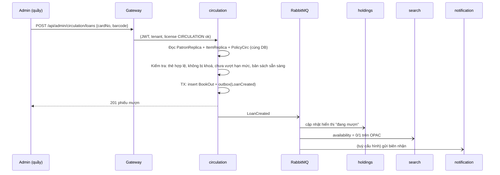
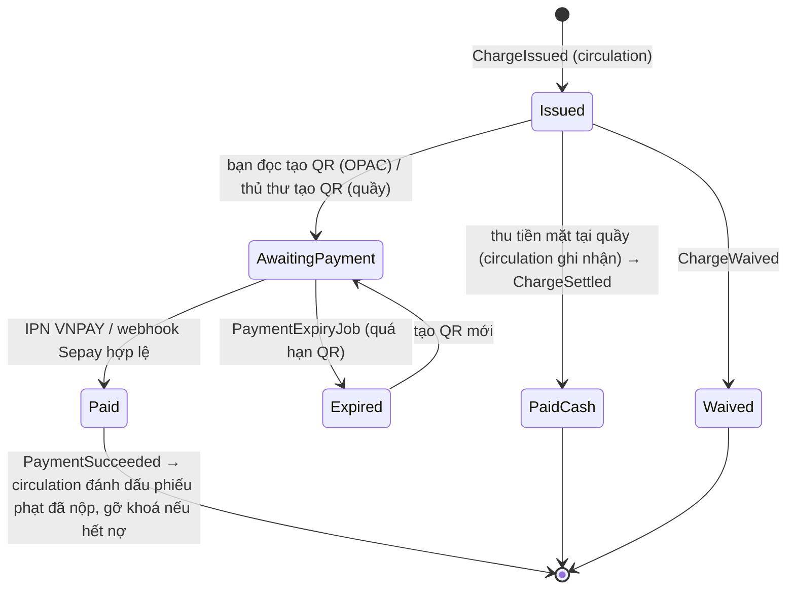

# 03 — Giao tiếp giữa các thành phần

## 1. Ba kiểu giao tiếp

| Kiểu | Dùng khi | Công nghệ |
|---|---|---|
| **Client → service** | Mọi request từ OPAC, Admin, kiosk, webhook | HTTPS → ingress → YARP gateway → REST của service |
| **Event (bất đồng bộ)** | Thông báo việc đã xảy ra; đồng bộ bản sao; kích hoạt nghiệp vụ ở service khác | RabbitMQ + MassTransit, transactional outbox/inbox |
| **Truy vấn đồng bộ nội bộ** | Cần câu trả lời ngay **và** không thể giữ bản sao (dữ liệu lớn, tính toán chuyên biệt) | gRPC, có Polly (timeout, retry có jitter, circuit breaker) |

**Quy tắc.** Một request từ người dùng **tối đa 1 hop gRPC** sang service khác. Nếu cần nhiều hơn thì thiết kế lại theo hướng bản sao cục bộ ([ADR-007](adr/ADR-007-local-replica.md)). Các nghiệp vụ lõi **không được gọi đồng bộ sang service khác**, gồm: mượn/trả, biên mục, đăng nhập, đặt phòng.

## 2. Gateway / BFF

Gateway là một YARP instance có hai route set: `/api/opac/**` (public + bạn đọc) và `/api/admin/**` (nhân viên). Webhook dùng đường dẫn riêng `/hooks/**`.

Pipeline xử lý của mỗi request:

```
ingress-nginx (TLS *.thuvientn.vn)
  → [1] TenantResolution   host <madonvi>.thuvientn.vn → tenant_id (cache Redis từ tenant service)
                           Admin: tenant lấy từ token; phải khớp host (trừ tài khoản cấp Sở/super-admin)
  → [2] Authentication     JWT RS256 qua JWKS của identity (bỏ qua với route anonymous)
  → [3] ModuleLicense      route có metadata module=CIRCULATION…; tenant chưa mua → 403 MODULE_NOT_LICENSED
                           (GĐ0: tra host qua /internal/tenants/by-host của service tenant, cache 60 giây — chưa nghe event)
  → [4] RateLimit          theo tenant + IP (OPAC), theo user (Admin), riêng cho /chat
  → [5] Header chuẩn hoá   X-Tenant-Id, X-Correlation-Id, traceparent; xoá header X-* do client tự gửi
  → [6] Proxy              /api/admin/circulation/** → circulation:8080/api/**
```

- **Kiểm tra lại trong service.** Service vẫn tự validate JWT và tenant, không tin mù quáng header từ gateway ([05](05-bao-mat.md#4-service-to-service)). Header `X-Tenant-Id` chỉ được dùng cho **route anonymous** của OPAC, và chỉ được chấp nhận khi request đi qua gateway (NetworkPolicy + chữ ký HMAC của gateway).
- **Ánh xạ route.** Mỗi service khai báo `routes.yaml` trong Helm chart (path, module, auth). Gateway nạp cấu hình động từ ConfigMap, nên thêm service mới không cần build lại gateway.
- **BFF composition.** Chỉ dùng cho màn hình OPAC cần ghép dữ liệu, ví dụ `MyLibrary` (đang mượn, đặt trước, ebook đang mượn, phí cần nộp, đặt phòng). Gateway gọi song song các service, mỗi lời gọi có timeout riêng, và **trả về từng phần** nếu một service lỗi (ví dụ thiếu khối "phí" khi `payment` down). Không đặt logic nghiệp vụ trong BFF.
- **SSE cho AI chat.** Gateway proxy streaming, tắt buffering (`ActivityTimeout` dài cho route `/api/opac/ai/chat/**`).
- **Webhook thanh toán.** URL `/hooks/vnpay/ipn` và `/hooks/sepay` được giữ cố định để đăng ký với cổng thanh toán, và chuyển thẳng tới `payment`. Không áp dụng JWT; xác thực bằng chữ ký của cổng.

## 3. Event

### 3.1 Quy ước

- **Contract:** C# `record` trong package `Elib.Contracts` (NuGet nội bộ, theo semver).
  - Tên event là động từ quá khứ: `LoanCreated`, `ReaderBlocked`.
  - Event **chỉ thêm field**. Đổi nghĩa thì tạo `V2` và chạy song song cho tới khi mọi consumer đã chuyển.
- **Envelope bắt buộc** (`IIntegrationEvent`): `EventId (Guid)`, `TenantId (long)`, `OccurredAt (UTC)`, `CorrelationId`, `Actor (UserId/ReaderId/system)`.
- **Payload tự đủ** thông tin consumer cần, để consumer không phải gọi ngược lại (event-carried state transfer). Ví dụ `ReaderUpdated` mang đủ các field của `PatronReplica`.
- **Topology:** MassTransit tạo exchange theo tên kiểu message và queue theo `{service}-{consumer}`. Dùng quorum queue, retry trong consumer `1s, 5s, 30s` (không cần plugin delayed-exchange; thêm redelivery dài hơn khi bật plugin). Sau đó message vào `_error`; có dashboard cảnh báo và công cụ đẩy lại.
- **Outbox/Inbox:**
  - **Outbox (EF Core):** publisher ghi event vào bảng outbox trong **cùng transaction** với dữ liệu nghiệp vụ.
  - **Inbox:** consumer dùng `EventId` để loại trùng, vì MassTransit đảm bảo at-least-once.
  - **Idempotent:** mọi consumer phải xử lý trùng lặp an toàn (upsert theo khoá, so `Version`/`OccurredAt` để bỏ event cũ hơn bản đang có).
- **Thứ tự:** không giả định thứ tự toàn cục. Bản sao lưu `SourceVersion` (số tăng dần do service nguồn gán) và chỉ ghi đè khi version mới hơn.

### 3.2 Danh mục event

| Event | Publisher | Consumer | Mục đích |
|---|---|---|---|
| `TenantProvisioned` | tenant | tất cả | Bắt đầu saga khởi tạo đơn vị: seed cấu hình mặc định |
| `TenantSeeded` | từng service | tenant (saga) | Báo service đã seed xong |
| `TenantUpdated` / `TenantSuspended` | tenant | tất cả | Cập nhật `TenantReplica`; đơn vị bị khoá thì chặn ghi |
| `ModuleLicenseChanged` | tenant | gateway, tất cả, frontend (qua API) | Bật/tắt module; service dừng job cho đơn vị không còn license |
| `SystemParameterChanged` | tenant | service liên quan | Xoá cache tham số |
| `PermissionChanged` | identity | tất cả | Xoá cache quyền của user/role (thay cho `PermissionStamp`) |
| `UserUpserted` | identity | audit, reporting | Snapshot tên nhân viên |
| `SystemPermissionChanged` (SystemEvent) | identity | tất cả | Quyền tài khoản cấp hệ thống thay đổi; consumer chạy ngữ cảnh hệ thống |
| `ReaderCreated` / `ReaderUpdated` / `ReaderDeleted` | patron | circulation, digital, space, payment, search, school, reporting | Cập nhật `PatronReplica` |
| `ReaderBlocked` / `ReaderUnblocked` | patron, circulation | circulation, digital, space | Khoá mượn/đặt phòng. Circulation tự phát khi nợ phạt vượt ngưỡng |
| `ReaderCardReissued` | patron | identity | Cập nhật định danh đăng nhập theo số thẻ mới |
| `BibPublished` / `BibUpdated` / `BibDeleted` | catalog | search, holdings, circulation, acquisition, digital | Index lại; cập nhật snapshot nhan đề, tác giả, phân loại |
| `AuthorityUpdated` | catalog | search | Index lại các biểu ghi dùng tiêu đề chuẩn |
| `OrderPlaced` / `ReceiptCompleted` | acquisition | holdings, reporting | Holdings tạo bản sách (barcode) chờ xử lý từ phiếu nhận |
| `IssueReceived` | serials | holdings, search | Kỳ ấn phẩm mới về kho |
| `ItemAdded` / `ItemUpdated` / `ItemStatusChanged` / `ItemRemoved` | holdings | circulation, search, reporting | Cập nhật `ItemReplica` (barcode, kho, điểm lưu thông, loại tài liệu, trạng thái vật lý) |
| `LoanCreated` / `LoanRenewed` / `LoanReturned` | circulation | holdings, search, reporting, school, notification | Tình trạng sẵn có trên OPAC, thống kê, huy hiệu, biên nhận |
| `LoanDueSoon` / `LoanOverdue` | circulation | notification | Nhắc hạn, báo quá hạn |
| `ItemDeclaredLost` | circulation | holdings | Holdings chuyển bản sách sang "mất" |
| `HoldReady` / `HoldExpired` | circulation | notification | Báo sách đặt trước đã sẵn sàng |
| `ChargeIssued` | circulation (phạt, sao chụp), patron (cấp lại thẻ) | payment | Tạo khoản cần thu (`SourceService`, `SourceId`, `Amount`, `ReaderId`) |
| `ChargeWaived` | circulation, patron | payment | Huỷ giao dịch chờ thanh toán |
| `ChargeSettled` | circulation, patron | payment, reporting | Đã thu tiền mặt tại quầy; payment đóng giao dịch QR đang chờ (nếu có) |
| `BibHoldingsEmpty` | holdings | catalog | Biểu ghi không còn bản sách nào; catalog gợi ý ẩn biểu ghi |
| `PaymentSucceeded` / `PaymentExpired` / `PaymentRefunded` | payment | circulation, patron, notification, reporting | Đánh dấu đã nộp; gửi biên lai |
| `EbookPublished` / `EbookUpdated` / `EbookUnpublished` | digital | search, reporting | Index metadata ebook |
| `EbookFileUploaded` | digital | digital-indexer | Kích hoạt trích xuất text/OCR |
| `EbookTextExtracted` | digital-indexer | search | Chunk, embedding (Ollama), index nội dung |
| `EbookLoanCreated` / `EbookLoanExpired` / `EbookRead` | digital | reporting, school, notification | Thống kê, huy hiệu, nhắc hạn |
| `RoomBookingConfirmed` / `RoomBookingCancelled` / `RoomCheckedIn` / `RoomBookingNoShow` | space | notification, reporting | Thông báo, thống kê; no-show có thể kéo theo `ReaderBlocked` (ban đặt phòng) |
| `LibraryVisitRecorded` | space | reporting, school | Lượt vào thư viện |
| `NewsPublished` | portal | search (tuỳ chọn), notification | Tin mới |
| `BadgeAwarded` | school | notification | Thông báo huy hiệu |
| `NotificationRequested` | mọi service | notification | Command gửi tin (template, người nhận, kênh) |
| `AuditRecorded` | mọi service | audit | Nhật ký thao tác (thay `UserLog`/`EntityHistory` ghi trực tiếp) |

## 4. Truy vấn đồng bộ (gRPC nội bộ)

| Lời gọi | Gọi từ → tới | Lý do không dùng bản sao | Khi service đích lỗi |
|---|---|---|---|
| `GET /internal/permissions?tenantId&userId` (HTTP + service token; **chưa dùng gRPC** ở GĐ0) | mọi service → identity | HybridCache (bộ nhớ + Redis) 5 phút, xoá theo `PermissionChanged`; chỉ gọi khi cache miss | Từ chối (fail-closed) |
| `Search.RetrieveChunks(query, filters)` | ai → search | Chỉ mục vector lớn | Chat trả lời "tạm thời không tra cứu được" |
| `Ai.MatchFace(image, candidates)` | space → ai | Tính toán chuyên biệt (LLM vision) | Check-in chuyển sang quét thẻ/thủ công |
| `Catalog.GetMarcRecord(bibId)` | holdings, acquisition (màn hình chi tiết) | Biểu ghi MARC đầy đủ lớn, ít dùng | Hiển thị snapshot, ẩn chi tiết MARC |
| `Reporting.Query(...)` | notification (báo cáo định kỳ) | Read model báo cáo | Thử lại theo lịch job |
| `Media.GetPresignedUrl(objectKey)` | mọi service | Không cần thiết: dùng thư viện `Elib.BuildingBlocks.Storage` ký URL tại chỗ | — |

## 5. Luồng nghiệp vụ tiêu biểu

### 5.1 Mượn sách (không gọi đồng bộ)



Nếu `holdings`, `search` hay `notification` đang down, việc mượn **vẫn thành công**. Event nằm chờ trong queue và được xử lý khi service khởi động lại.

### 5.2 Saga thu phí phạt



- **Trạng thái saga** lưu trong DB của `payment` (MassTransit saga repository EF).
- **Tiền mặt tại quầy:** `circulation` ghi nhận trực tiếp rồi phát `ChargeSettled`, để `payment` đóng giao dịch đang chờ (nếu có). Như vậy không xảy ra thu hai lần.
- **Tài khoản nhận tiền theo đơn vị** (VietQR/VNPAY) là cấu hình của `payment`, gắn với `TenantId`.

### 5.3 Saga khởi tạo đơn vị mới

1. Quản trị cấp hệ thống tạo đơn vị trong `tenant`: mã, subdomain, gói module. `tenant` phát `TenantProvisioned { modules[] }`.
2. Mỗi service thuộc module đã mua seed dữ liệu mặc định, rồi trả `TenantSeeded`. Ví dụ:
   - `identity`: admin đầu tiên, vai trò mẫu.
   - `circulation`: chính sách mặc định.
   - `catalog`: worksheet MARC.
   - `portal`: menu mặc định.
3. Saga trong `tenant` chuyển đơn vị sang `Active` khi đủ phản hồi. Quá 15 phút mà thiếu phản hồi thì chuyển `ProvisioningFailed`, có nút thử lại (seed idempotent).
4. Thay thế các script `run-tenant-seed.sql`, `modules-seed.sql`, `plan-clone-tenant-data.md` hiện nay.

### 5.4 Thanh lý sách

`holdings` lập biên bản thanh lý → `ItemRemoved` (lý do: thanh lý) → `circulation` bỏ khỏi `ItemReplica` → `search` cập nhật số bản. Nếu biểu ghi không còn bản nào, `catalog` nhận event `BibHoldingsEmpty` để gợi ý ẩn biểu ghi. Không tự xoá.

## 6. Xử lý lỗi và độ bền

- **Polly mặc định cho gRPC/HTTP nội bộ:** timeout 2s (AI: 60s), retry 2 lần với jitter cho lời gọi idempotent, circuit breaker mở khi 50% lỗi trong 30s.
- **Bulkhead:** `ai` và `search` dùng connection pool và giới hạn concurrency riêng, để LLM chậm không chiếm hết thread.
- **Dead-letter:** queue `_error` có cảnh báo Grafana. Công cụ `elibctl replay <queue>` dùng cho vận hành.
- **Rebuild read model:** mọi service sở hữu dữ liệu cung cấp endpoint nội bộ `GET /internal/export/{entity}?tenantId&cursor` (phân trang theo cursor). Hai việc dùng endpoint này:
  - `search`, `reporting` hoặc bản sao bị lệch có thể dựng lại toàn bộ.
  - Job đối soát hằng đêm so checksum số lượng giữa nguồn và bản sao.
