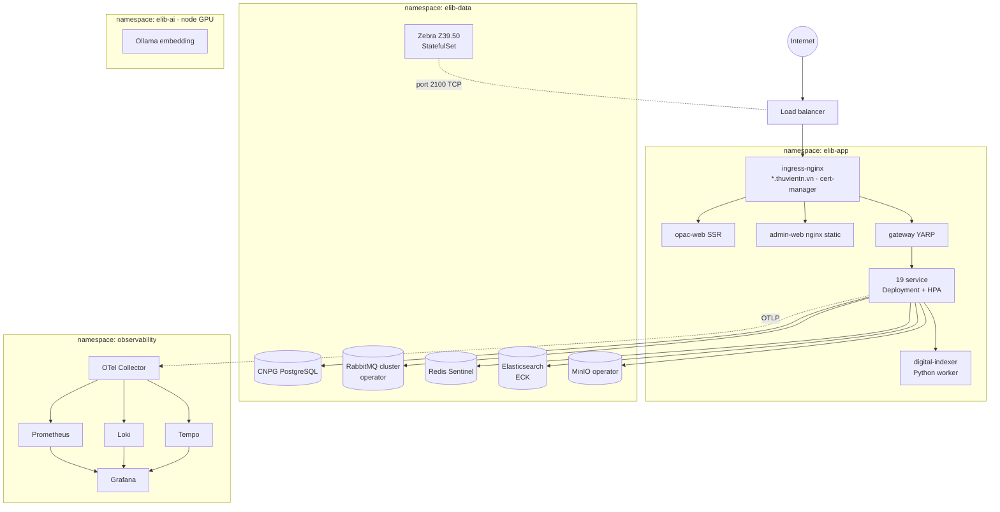

# 06 — Nền tảng Kubernetes

## 1. Topology

- **Môi trường:** `dev`, `staging`, `prod`, mỗi môi trường một cluster (hoặc một namespace nhóm trên cluster dev chung). Prod tách cluster.
- **Dữ liệu chạy trong cluster bằng operator** (CNPG, RabbitMQ Cluster Operator, ECK, MinIO Operator, Redis qua Bitnami chart). Ở profile SaaS trên cloud có thể thay bằng dịch vụ managed (Postgres, Redis) mà code không đổi.
- **Ollama** chạy trên node pool GPU (taint `gpu=true:NoSchedule`, toleration cho deployment Ollama). Không có GPU thì Ollama chạy CPU với concurrency thấp và chỉ phục vụ indexing nền; embedding truy vấn có thể dùng API embedding của nhà cung cấp LLM.
- **Zebra** cần cổng TCP 2100 ra ngoài, nên publish qua Service `LoadBalancer`/`NodePort` riêng hoặc ingress-nginx TCP services.

## 2. Profile triển khai

| | **SaaS tập trung** | **Cụm theo tỉnh** (on-prem / VM của Sở) |
|---|---|---|
| Quy mô | Nhiều tỉnh, hàng nghìn đơn vị | 1 tỉnh, vài trăm đơn vị |
| K8s | Managed K8s hoặc RKE2, ≥ 3 node app + node pool data + GPU | **k3s** 3 node (HA), không bắt buộc GPU |
| Service | Mỗi service một Deployment | Gộp host: `platform-host`, `backoffice-host` ([02 §4](02-phan-ra-service.md#4-gom-service-khi-triển-khai-nhỏ)); service tải cao vẫn tách riêng |
| Postgres | Nhiều cluster CNPG (tách cluster nóng) | 1 cluster CNPG (1 primary + 1 replica) |
| Elasticsearch | 3 node | 1–3 node |
| mTLS | Linkerd | Không (chỉ NetworkPolicy) |
| Secret | External Secrets + Vault | Sealed Secrets |
| Tài nguyên tối thiểu ước tính | — | 3 × (8 vCPU, 32 GB RAM, SSD 500 GB) |

Hai profile dùng **cùng image và cùng chart**, chỉ khác file `values-<profile>.yaml`.

## 3. Đóng gói và triển khai

- **Image:** mỗi service một image (`registry/elib/<service>:<semver>-<sha>`).
  - Base `mcr.microsoft.com/dotnet/aspnet:10.0-noble-chiseled` (non-root, read-only rootfs). Ngoại lệ: service xuất PDF bằng QuestPDF cần font, nên dùng base có fonts (`dotnet/aspnet:10.0` + DejaVu như Dockerfile hiện tại).
  - Ký image bằng cosign; quét bằng Trivy trong CI.
- **Helm:** một **library chart** `elib-service` dùng chung, chứa Deployment, Service, HPA, PDB, NetworkPolicy, ServiceMonitor, ConfigMap route cho gateway, và Job migration (pre-upgrade hook). Mỗi service chỉ có `values.yaml` mỏng.
- **GitOps (ArgoCD):**
  - Repo `deploy/` chứa `apps/<env>/<service>.yaml` (ApplicationSet).
  - CI build xong sẽ mở PR bump image tag cho `dev`, tự merge.
  - `staging` và `prod` thăng hạng bằng PR có duyệt.
  - Mỗi service rollback độc lập.
- **Chiến lược rollout:** RollingUpdate (`maxUnavailable 0`). Với `circulation`, `gateway`, `identity`: canary bằng Argo Rollouts (10% → 50% → 100%), có analysis theo error rate.
- **Probe:** `/healthz` (liveness, không kiểm tra phụ thuộc) và `/ready` (readiness: DB + RabbitMQ; ES/MinIO chỉ với service cần). Đây là pattern kế thừa từ monolith hiện tại.

## 4. Autoscale và tài nguyên (khởi điểm, chỉnh sau load test)

| Workload | Replica min–max | Tín hiệu HPA | Request (CPU/RAM) |
|---|---|---|---|
| opac-web (SSR) | 2–10 | CPU 60% | 250m / 512Mi |
| gateway | 2–8 | CPU 60%, RPS | 200m / 256Mi |
| search | 2–8 | CPU 60%, p95 latency | 300m / 512Mi |
| circulation | 2–6 | CPU 60% | 250m / 512Mi |
| digital | 2–6 | CPU 60% | 250m / 512Mi |
| ai | 1–6 | **Số stream SSE đang mở** (KEDA, custom metric) | 200m / 512Mi |
| notification, audit, reporting | 1–4 | **Độ dài queue RabbitMQ** (KEDA) | 100m / 256Mi |
| digital-indexer | 0–4 | Độ dài queue `EbookFileUploaded` (KEDA, scale-to-zero) | 1 / 2Gi |
| Các service còn lại | 1–3 | CPU 70% | 100–200m / 256–512Mi |

- Mọi Deployment có **PodDisruptionBudget** (`minAvailable: 1`) và topology spread qua các node.
- Giờ cao điểm mượn/trả (đầu giờ học, ra chơi) có thể cần thêm lịch scale trước (KEDA cron scaler).

## 5. Job nền

- Mỗi service tự chạy job của mình ([ADR-008](adr/ADR-008-jobs-per-service.md)):
  - Hangfire, storage là schema `hangfire` trong **DB của chính service đó**.
  - Server Hangfire chạy trong cùng Deployment (hoặc Deployment `-worker` riêng khi job nặng, ví dụ `digital-worker`, `reporting-worker`).
- **Dashboard Hangfire** của từng service được expose qua gateway tại `/ops/{service}/hangfire`, chỉ dành cho super-admin.
- **Job theo tenant** dùng `TenantJobRunner` ([04 §2.2](04-du-lieu-va-tenant.md#22-các-trường-hợp-đặc-biệt)), chỉ chạy cho tenant có license.
- **Tác vụ một lần cấp vận hành** (reindex toàn bộ, dựng lại bản sao) dùng Kubernetes `Job` từ image của service: `dotnet Service.dll --task reindex --tenant X`.

## 6. Observability

- **OpenTelemetry SDK** trong building block `Observability` gửi traces, metrics và logs qua OTLP tới OTel Collector.
  - Prometheus nhận metrics, Loki nhận logs, Tempo nhận traces; Grafana hiển thị tất cả.
  - Thay cho `ILogger` thuần và Seq trong đề xuất cũ.
- **Mỗi log/span gắn:** `service`, `tenant.id`, `user.id` (băm), `correlation.id`, `trace.id`. MassTransit tự truyền trace context qua message, nên một lượt mượn sách có thể được theo dõi từ gateway, qua circulation, tới các consumer.
- **Dashboard chuẩn:**
  - RED metrics cho mỗi service (rate, errors, duration).
  - Độ sâu queue và `_error` queue.
  - Độ trễ outbox.
  - Kết nối DB.
  - Cache hit Redis.
  - Độ trễ LLM và token/tenant.
  - Lỗi cổng thanh toán.
- **SLO và cảnh báo** (Alertmanager → email/Zalo/Telegram của đội vận hành):

  | SLO | Ngưỡng |
  |---|---|
  | Mượn/trả p95 | < 300 ms; khả dụng 99,9% giờ hành chính |
  | Tra cứu OPAC p95 | < 800 ms |
  | Đăng nhập p95 | < 500 ms |
  | Queue lag | < 60 s |
- **Tracing sampling:** 10% mặc định, 100% cho request lỗi (tail sampling ở collector).

## 7. CI

- **Monorepo, pipeline theo đường dẫn:** thay đổi trong `src/Services/Circulation/**` chỉ build và test `circulation`. Thay đổi trong `src/BuildingBlocks/**` hoặc `src/Contracts/**` thì build tất cả service phụ thuộc.
- **Các bước:** restore → build → unit test → integration test (Testcontainers: Postgres, RabbitMQ, Redis) → contract test → kiểm tra tương thích contract (so `Elib.Contracts` với phiên bản đã phát hành) → tenant-leak test → build image → Trivy → cosign → push → PR bump tag vào `deploy/`.
- **Công cụ:** GitHub Actions hoặc GitLab CI (repo hiện chưa có CI). Runner self-hosted cho profile tỉnh nếu cần đẩy image vào registry nội bộ.
