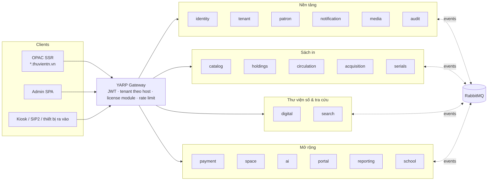

# ELIB K12 — Kiến trúc Microservice (thiết kế viết lại)

> Trạng thái: **Đề xuất v1** · 2026-10-07
> Bộ tài liệu này **thay thế** `backend/DLS_Microservice_Architecture.docx`. File docx cũ chỉ mô tả 5 service mẫu (User/Reader/Document/Borrowing/Catalog) và không phủ hết ~2.330 endpoint của hệ thống hiện tại.

## Tóm tắt

ELIB K12 hiện là một monolith .NET 10 (`ELIBAPI.sln`). Quy mô: 306 controller nghiệp vụ, 1 `ELIBAPIDbContext` với 242 bảng trên PostgreSQL, multi-tenant theo cột `TenantId`. Hệ thống được **viết lại** thành **19 service + 1 gateway** chạy trên Kubernetes, với các nguyên tắc sau:

- **Ranh giới:** mỗi service sở hữu riêng database (PostgreSQL/CloudNativePG), tự deploy và tự scale.
- **Gói bán:** service được gom theo gói. Đơn vị (tenant) chỉ thấy và gọi được module đã mua, và việc này được kiểm tra ngay tại gateway.
- **Giao tiếp:** ưu tiên bất đồng bộ qua RabbitMQ + MassTransit (outbox/inbox). Nghiệp vụ nóng như mượn/trả dùng **bản sao dữ liệu cục bộ**, nên không phụ thuộc service khác đang sống.
- **Cô lập tenant hai lớp:** EF Core global query filter và PostgreSQL Row-Level Security.
- **Frontend:** tách thành 2 app Angular, OPAC (SSR, public) và Admin (SPA), trong một Nx workspace.
- **Phạm vi khách hàng:** hệ mới phục vụ **khách hàng mới**. Monolith hiện tại tiếp tục chạy cho khách hàng cũ, nên không có ETL dữ liệu.

## Mục lục

| # | Tài liệu | Nội dung |
|---|---|---|
| 01 | [Hiện trạng và mục tiêu](01-hien-trang-va-muc-tieu.md) | Số liệu monolith, điểm coupling, mục tiêu, non-goals, ràng buộc |
| 02 | [Phân rã service](02-phan-ra-service.md) | 19 service, gói bán, trách nhiệm, **bảng ánh xạ toàn bộ controller/DbSet hiện tại → service** |
| 03 | [Giao tiếp](03-giao-tiep.md) | Gateway, REST/gRPC, danh mục event, saga, outbox, idempotency |
| 04 | [Dữ liệu và tenant](04-du-lieu-va-tenant.md) | Database-per-service, cô lập tenant, dữ liệu tham chiếu, license module, cache |
| 05 | [Bảo mật](05-bao-mat.md) | OpenIddict, token, permission, xác thực bạn đọc LDAP/API, service-to-service, secret |
| 06 | [Nền tảng Kubernetes](06-nen-tang-k8s.md) | Cluster, Helm/ArgoCD, observability, autoscale, job, hạ tầng dữ liệu |
| 07 | [Mẫu service](07-mau-service.md) | Cấu trúc monorepo, building blocks, quy ước code, testing |
| 08 | [Frontend](08-frontend.md) | Tách OPAC/Admin, thư viện dùng chung, ẩn/hiện theo license |
| 09 | [Lộ trình](09-lo-trinh.md) | GĐ0–GĐ4, deliverable, tiêu chí hoàn thành, rủi ro |

## Quyết định kiến trúc (ADR)

| ADR | Quyết định |
|---|---|
| [001](adr/ADR-001-viet-lai.md) | Viết lại toàn bộ, không strangler; hệ mới chỉ cho khách hàng mới |
| [002](adr/ADR-002-database-per-service.md) | Database-per-service trên PostgreSQL / CloudNativePG |
| [003](adr/ADR-003-tenant-isolation.md) | Tenant: shared DB trong service + global query filter + RLS |
| [004](adr/ADR-004-rabbitmq-masstransit.md) | RabbitMQ + MassTransit, transactional outbox/inbox |
| [005](adr/ADR-005-yarp-gateway-license.md) | YARP gateway, kiểm tra license module tại gateway |
| [006](adr/ADR-006-openiddict.md) | OpenIddict, token RS256 + JWKS |
| [007](adr/ADR-007-local-replica.md) | Bản sao cục bộ thay vì gọi đồng bộ trong lưu thông |
| [008](adr/ADR-008-jobs-per-service.md) | Job nền thuộc từng service |
| [009](adr/ADR-009-opentelemetry.md) | OpenTelemetry + Grafana (Prometheus/Loki/Tempo) |
| [010](adr/ADR-010-nx-frontend.md) | Tách OPAC/Admin trong Nx workspace |

## Công nghệ chốt

| Hạng mục | Lựa chọn |
|---|---|
| Runtime | .NET 10, ASP.NET Core, EF Core 10 (Npgsql) |
| Gateway | YARP |
| Identity | OpenIddict (RS256, JWKS, refresh token) |
| Message bus | RabbitMQ (quorum queues) + MassTransit (EF outbox/inbox, saga state machine) |
| Database | PostgreSQL 16 trên CloudNativePG, mỗi service một database + role |
| Cache | Redis (Sentinel) |
| Tìm kiếm | Elasticsearch (BM25 + kNN), Zebra Z39.50 |
| Lưu trữ file | MinIO (bucket theo service) |
| AI | Gemini (LLM, vision), Ollama (embedding, node GPU) |
| Job nền | Hangfire, storage trong DB của từng service |
| Observability | OpenTelemetry → Prometheus, Loki, Tempo, Grafana |
| Triển khai | Kubernetes, Helm, ArgoCD (GitOps), ingress-nginx, cert-manager, External Secrets |
| Frontend | Angular 21 trong Nx workspace: `opac` (SSR), `admin` (SPA) |
